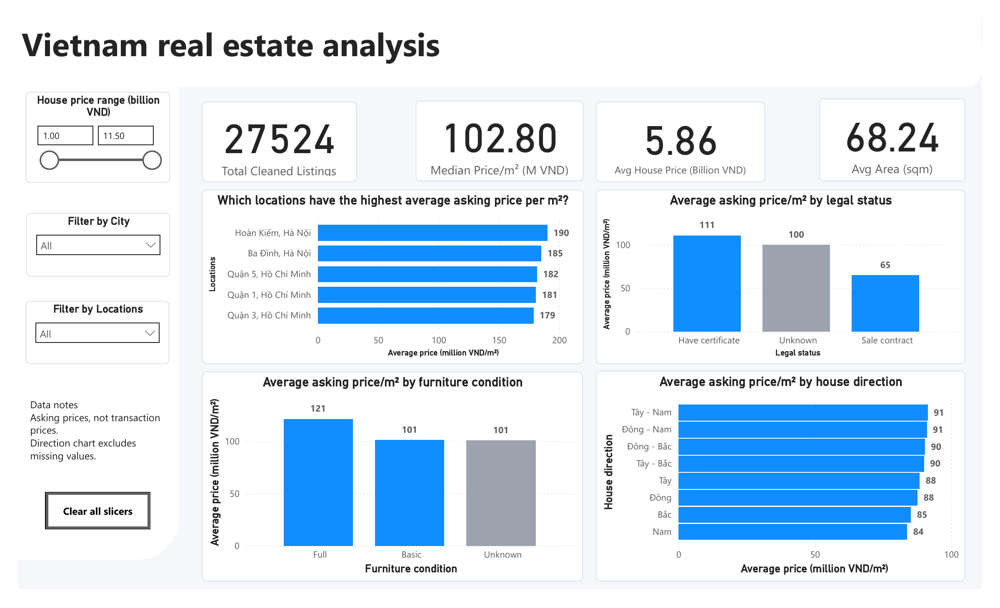

# Vietnam Real Estate Market Analysis & Data Warehouse

In this project, I used PostgreSQL to clean and analyze 30,229 Vietnamese property listings from Kaggle, then built a Power BI report to explore the results. Most of the data preparation and analysis is done in SQL.

**Scope:** This project uses a dataset labeled 2024. It analyzes asking prices, not completed transaction prices, and does not describe current market conditions or establish causal effects.

## Project Overview

### Why the Data Needed Cleaning

The dataset contains inconsistent addresses, missing property attributes, probable duplicate listings, and suspicious area values. I documented how I handled these issues before comparing asking prices across locations and property characteristics.

### What I Did

- Cleaned the data and organized the retained listings into a star schema.
- Compared asking prices per square metre by location, legal status, furniture condition, and house direction.
- Used Z-scores to flag unusually high or low asking prices within each location for further review.
- Built a Power BI report with location and price filters, price units, and listing counts in tooltips.

## Data Summary

| Metric | Value | Meaning |
| --- | ---: | --- |
| Raw listings | 30,229 | Records imported from the source dataset |
| Address-parsing exclusions | 3 | Records that did not meet the address-parsing rule |
| Probable duplicate rows removed | 2,699 | Repeated combinations of address, asking price, and area |
| Retained listings | 27,527 | Records retained in staging and the fact table |
| Retention rate | 91.06% | Retained listings divided by raw listings |
| Area-suspect records retained | 3 | Flagged records preserved in the database |
| Listings passing the area-quality filter | 27,524 | Records available before analysis-specific filters |

The row counts follow: **30,229 - 3 - 2,699 = 27,527**, then **27,527 - 3 = 27,524** after applying the area filter.

The address-parsing exclusions and area-suspect records are different groups. Individual analyses can use fewer observations because of missing attributes or minimum sample-size rules.

## Dataset

### 1. Data Source & Scope

- **Source:** [Vietnam Housing Dataset 2024 on Kaggle](https://www.kaggle.com/datasets/nguyentiennhan/vietnam-housing-dataset-2024).
- **Source account:** `nguyentiennhan`.
- **Geographic scope:** Vietnamese property listings with city and district information derived from their addresses.
- **Observation type:** A listing record, not a completed sale or a guaranteed unique physical property.

The dataset was obtained from Kaggle; I did not scrape the original listings. Source attribution does not establish permission to redistribute the data. Check the dataset's license and reuse terms before redistributing it or making an embedded report publicly accessible.

### 2. Dataset Structure

| Attribute group | Main fields used |
| --- | --- |
| Location | Address, city, district |
| Price and size | Asking price, area, asking price per square metre |
| Physical characteristics | Frontage, floors, bedrooms, bathrooms |
| Listing attributes | Legal status, furniture condition, house direction |

Total asking price is expressed in **billion VND**, area in **m²**, and unit price in **million VND/m²**. Unit price is derived as total price multiplied by 1,000 and divided by area, then stored rounded to one decimal place. Division by zero is guarded with `NULLIF`.

## Tools & Workflow

| Tool | Role |
| --- | --- |
| Supabase | Hosted PostgreSQL database |
| DBeaver | SQL development and query execution |
| PostgreSQL | Data cleaning, dimensional modeling, and analysis |
| Power BI | Interactive reporting and measures |
| Git & GitHub | Version control and project documentation |

Workflow: **Source CSV → Raw table → Cleaned staging table → Star schema → SQL analysis → Power BI report**.

## Data Quality & Cleaning

- **Address parsing:** Retain addresses with at least two comma-separated components, then extract the last two components as district and city. Apply normalization and targeted corrections to observed parsing problems.
- **Text standardization:** Normalize Unicode and whitespace and standardize selected location-name variants.
- **Missing information:** Label missing legal status and furniture condition as `Unknown`. Preserve missing numeric values and house directions as `NULL`.
- **Probable duplicates:** Keep one record per matching address, asking-price, and area combination. This is a deduplication heuristic, not proof that the records describe the same property.
- **Area checks:** Flag records where `area_sqm IS NULL OR area_sqm <= 5`. Retain these records in the database but exclude them from the main analyses.
- **Dimensional references:** Use foreign key constraints for populated dimension references. Missing references can remain `NULL`; referential integrity and data completeness are separate checks.

House direction is missing in **19,468 of 27,527 retained records (70.72%)**. Direction-based comparisons therefore cover only a subset of the retained data.

See [Data Quality & Cleaning Log](DATA_QUALITY_LOG.md) for observations, cleaning decisions, and lessons learned.

## Data Model

The fact table stores one row per retained listing record. Generated IDs identify database records, not independently verified properties.

| Table | Purpose |
| --- | --- |
| `fact_housing` | Listing prices, area, physical attributes, area-quality flag, and dimension keys |
| `dim_location` | City–district combinations |
| `dim_legal` | Legal-status categories |
| `dim_furniture` | Furniture-condition categories |
| `dim_direction` | House-direction categories |

The fact table connects to the dimensions through `location_id`, `legal_id`, `furniture_id`, and `direction_id`. Location comparisons use city–district combinations rather than district names alone because district names can repeat across provinces.

## Analysis Questions

| Analysis | Approach |
| --- | --- |
| 1. Unusual asking prices within locations | Within-location Z-scores; display up to 50 observations passing the absolute-score threshold of 3 |
| 2. Furniture condition and unit price | Compare average asking price/m² by category, using `Basic` as the reference group |
| 3. Legal status and unit price | Compare average asking price/m² by category, using `Have certificate` as the reference group |
| 4. House direction and unit price | Compare average asking price/m² across populated direction categories |
| 5. Property size and layout | Compare bedroom–bathroom groups and area bands using average area and/or total asking price |
| 6. Highest- and lowest-priced locations | Rank average asking price/m² among locations with at least 30 non-null unit-price observations |

All analyses exclude area-suspect records. Bedroom–bathroom comparisons also require positive room counts and at least 30 records per group. These minimum-size rules do not apply to every categorical comparison.

The Z-score query identifies observations for further investigation; it does not delete them or exclude them from subsequent averages.

The analysis uses CTEs, joins, window functions, conditional logic, aggregation, area bucketing, and ranking. See [Business Insights SQL](05_business_insights.sql).

## Selected Findings

With no city or location selection and area-suspect records excluded, the Power BI overview shows:

| Overview metric | Value |
| --- | ---: |
| Listings passing the area-quality filter | 27,524 |
| Median asking price/m² | 102.80 million VND/m² |
| Average total asking price | 5.86 billion VND |
| Average listed area | 68.24 m² |

In that report view:

1. **Location differences:** Hoàn Kiếm, Hà Nội leads the displayed eligible location ranking at approximately **190 million VND/m²**. This is a ranking within the dataset and its filters, not a claim about every location in Vietnam.
2. **Furniture differences:** `Full` listings average approximately **121 million VND/m²**, compared with **101 million VND/m²** for `Basic` listings. The comparison does not isolate the value of furniture from location, size, or other property differences.
3. **Legal-status differences:** `Have certificate` listings average approximately **111 million VND/m²**, compared with **65 million VND/m²** for `Sale contract` listings. This is a comparison between listing groups, not an estimate of the causal effect of obtaining a certificate.

These figures are rounded values from the report snapshot. Filtering changes the observations included and can change the results. Category labels reflect the source data; they are not independent verification of a property's condition or legal documentation.

## Power BI Dashboard

[Open or download the Power BI report](<dashboard 1 (1).pbix>).

The report includes:

- Summary metrics for listing count, asking prices, and area.
- A top-location chart and comparisons by legal status, furniture condition, and house direction.
- City, location, and total-price slicers, plus a clear-slicers button.
- Listing counts in chart tooltips and notes explaining the price and missing-direction scope.

The location chart uses a minimum of 30 populated unit-price observations in the current filter context and a Top 5 setting. The SQL location query reports both Top 10 highest- and lowest-priced groups. The dashboard and SQL outputs therefore have different display sizes.

## Repository Guide

| File | Purpose |
| --- | --- |
| [01_init_and_parse_staging.sql](01_init_and_parse_staging.sql) | Create staging data and parse addresses |
| [02_transform_staging_housing.sql](02_transform_staging_housing.sql) | Clean, standardize, deduplicate, derive unit prices, and flag suspect areas |
| [03_create_dim_table.sql](03_create_dim_table.sql) | Create and populate dimensions |
| [04_create_fact_table.sql](04_create_fact_table.sql) | Create and populate the fact table |
| [05_business_insights.sql](05_business_insights.sql) | Run the analytical queries |
| [06_validation_checks.sql](06_validation_checks.sql) | Run read-only checks for row counts, missing values, foreign-key references, and selected location mappings |
| [DATA_QUALITY_LOG.md](DATA_QUALITY_LOG.md) | Record data issues, decisions, and checks |

## How to Reproduce

### Requirements

- PostgreSQL with UTF-8 encoding and support for Unicode normalization, locally or through Supabase.
- A SQL client such as DBeaver.
- The source dataset from Kaggle.
- Power BI Desktop if opening the interactive report.

### Execution Steps

1. Create a dedicated PostgreSQL database for this project and download the source CSV. Use the `public` schema for the project tables.

2. Import the CSV into `public.raw_housing`. The repository does not include a raw-table creation or import script. Preserve the source column names expected by script `01`, and import numeric attributes as suitable numeric types. The scripts assume `Price` is in billion VND and `Area` is in m².

3. Execute scripts `01` through `04` in order in the project database, with `public` as the active schema. Review the intermediate outputs and compare row counts with the data-quality log.

4. Run `06_validation_checks.sql`. These read-only queries check row counts, missing values, unmatched foreign-key references, and selected location mappings. Compare the results with the documented checks; they do not establish that every field is correct.

5. Run individual analyses from `05_business_insights.sql` and interpret their results using the documented filters and limitations.

6. If using Power BI, configure the report's source connection for your PostgreSQL instance and refresh the data. Check the default summary metrics against the SQL results before interpreting filtered views.

The required raw-table headers are `Address`, `Area`, `Frontage`, `Access Road`, `House direction`, `Balcony direction`, `Floors`, `Bedrooms`, `Bathrooms`, `Legal status`, `Furniture state`, and `Price`.

**Execution warning:** These scripts are an exploratory build sequence, not safely repeatable migrations. Script `02` adds columns and deletes probable duplicate staging rows. Scripts `03` and `04` use `DROP TABLE ... CASCADE` to rebuild tables, which can also remove dependent objects or constraints. Review the scripts and use a dedicated environment rather than rerunning them against unrelated or production data.

## Limitations

- **Historical listing data:** A dataset labeled 2024 does not establish current market conditions. Asking prices are not completed transaction prices or independently assessed fair values.
- **Coverage:** The dataset is not a representative sample of the entire Vietnamese housing market. Locations and attribute groups have different sample sizes.
- **Missing information:** Direction comparisons cover a limited subset. Numeric averages ignore `NULL` values, so a group's listing count can exceed the number of observations used in its average.
- **Cleaning assumptions:** Address parsing, targeted corrections, and the deduplication rule can misclassify records. Passing the area filter is not proof that every remaining field is correct.
- **Descriptive comparisons:** Group averages do not control for location, property type, size, and other possible confounders. They do not demonstrate causation.
- **Statistical screening:** Z-scores depend on the within-location price distribution and can be influenced by extreme values. A threshold of 3 is a screening rule, not proof of a pricing error.
- **Sample-size thresholds:** Requiring 30 observations is a reporting choice, not a guarantee of representativeness or statistical reliability.
